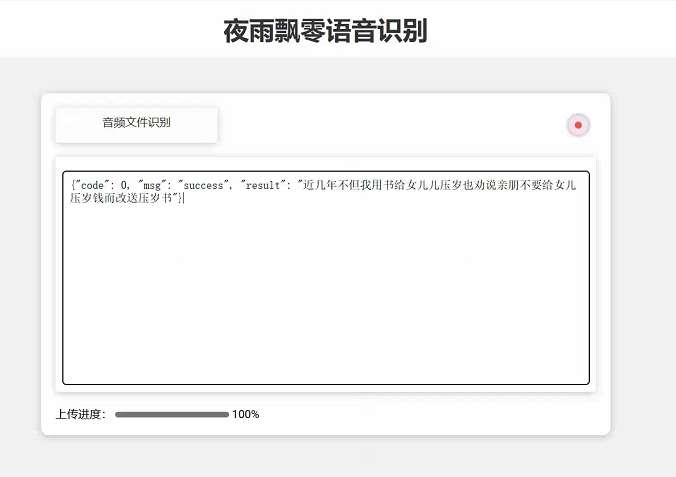
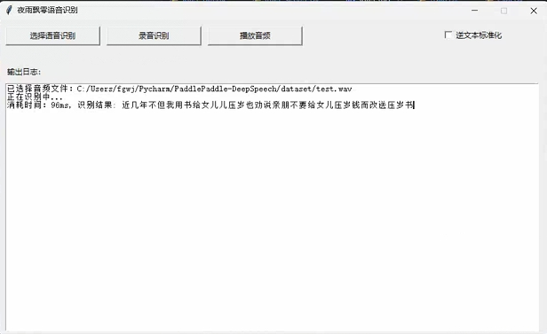

# MASR流式与非流式语音识别


MASR是一款基于Pytorch实现的自动语音识别框架，MASR全称是神奇的自动语音识别框架（Magical Automatic Speech Recognition），MASR致力于简单，实用的语音识别项目。可部署在服务器，Nvidia Jetson设备，未来还计划支持Android等移动设备。

本项目使用的环境：
 - Anaconda 3
 - Python 3.7
 - Pytorch 1.10.0
 - Windows 10 or Ubuntu 18.04

## 在线使用

 - [在线使用Dome](https://masr.yeyupiaoling.cn)

## 更新记录

 - 2022.01.16: 支持多种预处理方法。
 - 2022.01.15: 支持英文语音识别。
 - 2022.01.13: 支持给识别结果加标点符号
 - 2021.12.26: 支持pip方式安装。
 - 2021.12.25: 初步完成基本程序。

## 模型下载
|                                            数据集                                            |    使用模型     | 语言  |                                     解码参数                                      | 测试集字错率（词错率） |                              下载地址                               |
|:-----------------------------------------------------------------------------------------:|:-----------:|:---:|:-----------------------------------------------------------------------------:|:-----------:|:---------------------------------------------------------------:|
|             [aishell](https://openslr.magicdatatech.com/resources/33) (179小时)             | deepspeech2 | 中文  | alpha=2.2<br>beta=4.3<br>beam_size=300<br>cutoff_prob=0.99<br>cutoff_top_n=40 |   0.06346   | [点击下载](https://download.csdn.net/download/qq_33200967/71141450) |
| [free_st_chinese_mandarin_corpus](https://openslr.magicdatatech.com/resources/38) (109小时) | deepspeech2 | 中文  | alpha=2.2<br>beta=4.3<br>beam_size=300<br>cutoff_prob=0.99<br>cutoff_top_n=40 |   0.13941   | [点击下载](https://download.csdn.net/download/qq_33200967/71495689) |
|             [thchs_30](https://openslr.magicdatatech.com/resources/18) (34小时)             | deepspeech2 | 中文  | alpha=2.2<br>beta=4.3<br>beam_size=300<br>cutoff_prob=0.99<br>cutoff_top_n=40 |   0.06751   | [点击下载](https://download.csdn.net/download/qq_33200967/71142778) |
|                             超大数据集(1600多小时真实数据)+(1300多小时合成数据)                              | deepspeech2 | 中文  | alpha=2.2<br>beta=4.3<br>beam_size=300<br>cutoff_prob=0.99<br>cutoff_top_n=40 |   0.06215   | [点击下载](https://download.csdn.net/download/qq_33200967/75138230) |
|           [Librispeech](https://openslr.magicdatatech.com/resources/12) (960小时)           | deepspeech2 | 英文  | alpha=1.9<br>beta=0.3<br>beam_size=500<br>cutoff_prob=1.0<br>cutoff_top_n=40  |     训练中     |                               训练中                               |                               训练中                               |


**说明：** 
1. 这里字错率是使用`eval.py`程序并使用集束搜索解码`ctc_beam_search`方法计算得到的。
2. 下载的压缩文件已经包含了`mean_std.npz`和`vocabulary.txt`，需要把解压得到的全部文件复制到项目根目录下。

>有问题欢迎提 [issue](https://github.com/yeyupiaoling/MASR/issues) 交流


## 文档教程

- [快速安装](./docs/install.md)
- [数据准备](./docs/dataset.md)
- [WenetSpeech数据集](./docs/wenetspeech.md)
- [合成语音数据](./docs/generate_audio.md)
- [数据增强](./docs/augment.md)
- [训练模型](./docs/train.md)
- [集束搜索解码](./docs/beam_search.md)
- [执行评估](./docs/eval.md)
- [导出模型](./docs/export_model.md)
- [使用标点符号模型](./docs/punctuation.md)
- 预测
   - [本地模型](./docs/infer.md)
   - [长语音模型](./docs/infer.md)
   - [Web部署模型](./docs/infer.md)


## 快速预测

 - 下载作者提供的模型或者训练模型，然后执行[导出模型](./docs/export_model.md)，使用`infer_path.py`预测音频，通过参数`--wav_path`指定需要预测的音频路径，完成语音识别，详情请查看[模型部署](./docs/infer.md)。
```shell script
python infer_path.py --wav_path=./dataset/test.wav
```

输出结果：
```
-----------  Configuration Arguments -----------
alpha: 1.2
beam_size: 10
beta: 0.35
cutoff_prob: 1.0
cutoff_top_n: 40
decoding_method: ctc_greedy
enable_mkldnn: False
is_long_audio: False
lang_model_path: ./lm/zh_giga.no_cna_cmn.prune01244.klm
mean_std_path: ./dataset/mean_std.npz
model_dir: ./models/infer/
to_an: True
use_gpu: True
use_tensorrt: False
vocab_path: ./dataset/zh_vocab.txt
wav_path: ./dataset/test.wav
------------------------------------------------
消耗时间：132, 识别结果: 近几年不但我用书给女儿儿压岁也劝说亲朋不要给女儿压岁钱而改送压岁书, 得分: 94
```


 - 长语音预测

```shell script
python infer_path.py --wav_path=./dataset/test_vad.wav --is_long_audio=True
```


 - Web部署




 - GUI界面部署




## 相关项目
 - 基于Pytorch实现的声纹识别：[VoiceprintRecognition-Pytorch](https://github.com/yeyupiaoling/VoiceprintRecognition-Pytorch)
 - 基于Pytorch实现的分类：[AudioClassification-Pytorch](https://github.com/yeyupiaoling/AudioClassification-Pytorch)
 - 基于PaddlePaddle实现的语音识别：[PPASR](https://github.com/yeyupiaoling/PPASR)


## 参考资料
 - https://github.com/yeyupiaoling/PPASR
 - https://github.com/jiwidi/DeepSpeech-pytorch
 - https://github.com/wenet-e2e/WenetSpeech
 - https://github.com/SeanNaren/deepspeech.pytorch
